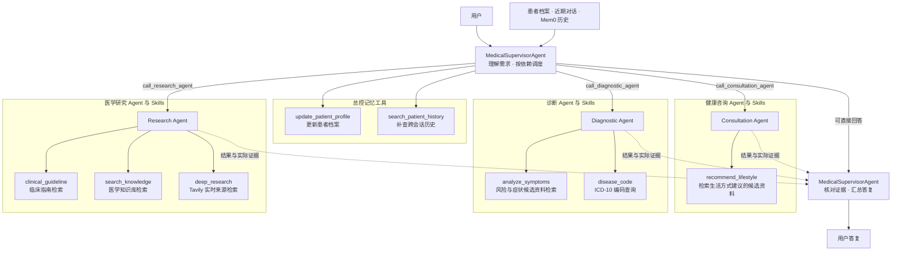

# Medical Agent Assistant

这是一个研究医疗助手如何分工、使用证据和记住用户信息的工程项目，同时包含一个小型医疗模型的训练实验。

**医疗助手**由总控 Agent 接收问题，按需要调用健康咨询、诊断和医学研究三个专业 Agent，再结合检索资料汇总答复。患者档案保存用户明确提供的稳定信息，长期记忆支持跨会话回查，检索工具提供可追溯的回答依据。

**模型训练**以 Qwen3.5-2B 为基础，比较学习医学原文、学习问答示例以及按回答评分优化模型这几种方法。Agent 系统通过模型 API 运行，下面的整体测评使用 Qwen3.5-27B；小模型训练单独评测，尚未作为该组 Agent 整体测试的执行模型。

[Agent 使用说明](medix-agent-swarm/README.md) · [Agent 整体测评](#agent-整体测评) · [Agent 架构对照](results/agent-architecture-comparisons-2026-09-10/README.md) · [Agent 关键设计](#agent-关键设计) · [SFT 规模与 CPT 机制](results/training-scale-cpt-2026-09-11/README.md) · [训练与推理](MediX-R1/README.md) · [模型与数据](https://huggingface.co/collections/starttoshow/medix-medical-sft-and-gspo-6a9e6f31b80642f4ba8b6f28) · [全部精选测评](results/README.md)

## Agent 关键设计

项目迭代围绕总控如何分工、跨轮状态怎样更新、历史如何回查以及证据怎样交付展开。当前保留六项核心设计：

| 设计 | 当前实现 |
| --- | --- |
| **按语义与依赖调度** | 总控根据问题和已有结果选择专业 Agent；包括同专业在内的独立任务可同轮并行，依赖由模型判断、分轮执行，各 Worker 只获得职责内工具 |
| **分层记忆与上下文预算** | 患者档案保存稳定事实，近期对话按完整轮次与字符预算保留，Mem0 提供跨会话事件检索 |
| **有原话依据的档案更新** | 模型提议新增、更正、否定和停用状态；代码校验用户范围与本轮原话证据后持久化 |
| **主动补查与来源保留** | 初始历史不足时调用补查工具；新记忆保留有长度上限的用户原话，区分事件、咨询与系统保存时间 |
| **证据交付与复用** | Worker 返回实际检索摘录供总控核对；同一次调用内复用相同请求，并用引用代替重复文档正文 |
| **执行控制与可追溯状态** | 正式工具调用经过白名单、参数和作用域检查；配置调用上限、轮数与超时，记录实际执行及返回结果 |

[当前执行流程与上下文](medix-agent-swarm/README.md#执行流程与上下文) · [9 月 9 日冻结版本的设计与整体验证](results/agent-current-2026-09-09/README.md)。下图展开总控、专业 Agent 和实际注册的工具/Skills。



图中列出最多 **5 个总控工具和 6 个 Worker Skills**；节点名称对应实际调用函数。上下两个 `MedicalSupervisorAgent` 节点表示同一总控的调度与汇总阶段。总控记忆工具按用户身份和长期记忆配置启用。Skills 由说明元数据和可执行 Python 函数组成；风险与症状共用一个检索工具，判断由诊断 Agent 完成。[Agent 注册代码](medix-agent-swarm/agents/) · [Skills 实现](medix-agent-swarm/.claude/skills/)

## 核心结果

| 项目工作 | 实验比较与主要结果 | 详细说明 |
| --- | --- | --- |
| 多轮任务完成情况 | 72 个合成场景中，67 场的全部适用检查项获两位模型评审通过 | [场景、回答与评分](results/agent-current-2026-09-09/README.md) |
| 专业分工的运行效率 | 在 32 道资料核对题上，相对一个助手连续多轮复核，独立分工方案平均耗时减少 41.3%、输入文本量减少 74.8%；两组完整正确均为 13/32 | [分工方案与对照方法](results/agent-architecture-comparisons-2026-09-10/README.md) |
| 检索资料是否齐全 | 432 条可回答查询中，每次取前三篇资料比只取第一篇多覆盖 75 个问题所需的全部来源 | [检索数据与结果](results/hybrid-grounding-2026-09-08/README.md) |
| 问答训练数据的组成 | 使用 5,000 条通用与医疗混合示例，相对原项目 5,418 条医学问答，通用答案满分率增加 16.83 个百分点 | [数据来源、数量与评分](results/training-scale-cpt-2026-09-11/README.md#sft-数据规模与组成) |
| 学习医学原文 | 继续学习约 808 万 token 的文本后，600 道医学选择题的选项排名正确数由 305 增至 325 | [医学原文训练实验](results/training-scale-cpt-2026-09-11/README.md#关键词-cpt-语料) |
| 医学图像问答优化 | 93 个图像问题上，按回答评分继续优化后，归一化评分从 60.75 增至 66.13 | [图像问答训练与评分](results/model-evaluations-2026-09-09/README.md) |

## Agent 测评

### Agent 整体测评

运行 9 月 9 日冻结版本的完整 Supervisor、专业 Agent、患者档案、记忆和工具流程，检查系统能否完成多轮任务。**被测模型统一为 Qwen3.5-27B；MiniMax M2.5 与 Qwen3.5-27B 分别担任独立评审。**

| 能力 | 场景数 | 执行完成 | 有效双评 | 全部适用检查项通过 |
| --- | ---: | ---: | ---: | ---: |
| 多轮问诊与咨询 | 24 | 24 | 23 | **21/24** |
| 病史与跨会话记忆 | 24 | 24 | 24 | **23/24** |
| 证据检索与使用 | 24 | 24 | 24 | **23/24** |
| **合计** | **72** | **72** | **71** | **67/72（93.1%）** |

每类含常规、复杂、边界各 8 个合成场景；通过要求两名评审对全部适用项均判通过。1 场评分错误仍计入 72 场分母。该组是冻结版本在已用于迭代的历史场景上的回归表现，逐轮核对回答、前后档案和工具证据；不构成多 Agent 优于单 Agent 的对照，也不是 9 月 10 日代码的重新验收。

同批运行共记录 **365 次工具请求、195 次检索后端执行**，含预置历史的场景耗时中位数 **84.8 秒**。

[完整方法与结果](results/agent-current-2026-09-09/README.md) · [72 场逐项评分表](results/agent-current-2026-09-09/case_scores.csv) · [回答与双评理由](results/agent-current-2026-09-09/case_results.json) · [原始轨迹与评分](results/agent-current-2026-09-09/evidence.zip)

### Agent 架构与任务覆盖对照

这组实验让助手阅读模拟资料，核对不同患者、日期和适用条件对应的待办事项。“连续复核单 Agent”让同一个助手分多个方向依次检查；“独立分工多 Agent”让专业助手各自阅读相关资料，再由总控合并清单。下面的效率数字比较这两种完整流程，分工方案是评测原型。

在 32 道多事项核对题、898 个标准事项上，连续复核单 Agent 与独立分工多 Agent 的完整正确清单均为 **13/32**。分工方案在 24/32 道题中实际并发，平均耗时由 **119.8 秒降至 70.3 秒（−41.3%）**，输入 token 从 **2,486,128 降至 627,044（−74.8%）**。

另一组 12 场景、四种架构、96 次主对照及 12 次串行消融定位了“同专业不同任务”误拒绝：实验时的旧版方案出现 9 次，独立任务候选为 0 次。两组实验的冻结输入、逐项分析、108 次架构运行、128 次覆盖率运行及 1,248 份轨迹/评分证据已公开。[完整架构报告与离线复算](results/agent-architecture-comparisons-2026-09-10/README.md)

### Agent 调度效率

在固定的诊断、问诊和研究三个独立任务上，使用 **MiniMax M2.5 作为被测 Agent 模型**，串行与并行各执行 3 次。Worker 批次平均耗时由 **49.80 秒降至 20.15 秒，缩短 59.5%**。计时覆盖子任务执行阶段，总控规划和汇总另计。

两组使用同一模型、同一批任务，只改变调度方式；这是调度耗时对照。完整流程的请求数、费用和耗时另见 [架构测评](results/2026-09-08/architecture.md)。

### RAG 证据覆盖

RAG（检索增强生成）先从知识库找资料，再让模型依据资料回答。本项先检查检索阶段：返回的资料是否包含回答问题所需的全部来源。Top 1、Top 3、Top 5 分别表示取排名前一篇、前三篇和前五篇。

在 **1,016 篇 MedlinePlus 健康主题摘要、800 条查询**的固定数据上，以 **Qwen3-Embedding-8B 生成检索向量**，按预先标注的目标来源直接计算覆盖，无需回答评分模型。测试集有 432 条完全可回答查询，保持同一排名，只改变返回的候选数量：

| 检索配置 | 完整目标来源覆盖 | 覆盖率 |
| --- | ---: | ---: |
| Top 1 | 333/432 | 77.1% |
| Top 3 | **408/432** | **94.4%** |
| Top 5 | 421/432 | 97.5% |

Top 3 比 Top 1 多覆盖 **75 个问题所需的全部来源**，说明保留多个候选能更好地支持多证据问题。统计使用无相似度过滤的固定排序，衡量检索覆盖；资料来自公开摘要，查询为合成检索任务。[数据、排名与复算](results/hybrid-grounding-2026-09-08/retrieval/summary.json)

### Mem0 跨会话记忆

Mem0 是本项目使用的长期记忆组件：从对话提取用户信息，保存后供下次会话查询。本项通过关闭并重开存储，检查记忆是否真正持久化，以及返回的记忆能否支持预设的历史问题。

冻结组件测评包含 **120 个合成场景、240 次正向查询**；每个场景写入两次会话，关闭并重新打开本地 Mem0 OSS / Qdrant 存储。测试集为 96 场景、192 次正向查询，固定实际召回记录及阈值 0.3：

| 检索配置 | 全部预期事实得到记忆支持 | 支持率 |
| --- | ---: | ---: |
| Top 3 | 176/192 | 91.7% |
| Top 10 | 184/192 | 95.8% |

未知用户与其他应用的查询空返回均为 **96/96**。这验证持久化、作用域和候选事实覆盖；该组件实验预先指定查询，没有测试总控是否会主动发现缺口并构造补查。后续回答实验复核并修正了 11 项旧记忆标签，原始冻结分数仍保留，见[组件报告](results/component-benchmark-2026-09-08/memory/README.md)及[标签修正与回答延伸](results/hybrid-grounding-2026-09-08/README.md#本地-mem0从历史召回到回答)。

### 工程回归测试

9 月 9 日记录有 **104 项 Agent 测试和 48 项评测运行器测试**通过；9 月 10 日更新另运行 **81 项针对性测试**，覆盖角色工具集合、同专业任务并行、搜索参数、错误返回、上下文、证据回传与复用。网络输出使用确定性测试替身，历史与本次测试数量不相加作为独立能力样本。[测试代码](medix-agent-swarm/tests/)

## 模型训练与数据

训练目标是让一个 2B 参数规模的模型适应医学问答，同时检查通用能力是否保留。持续预训练（CPT）学习医学原文；监督微调（SFT）学习带推理和答案的问答示例；GSPO 根据回答奖励做进一步优化。LoRA 是这些实验使用的参数高效微调方式。图像问答在报告中简称 VQA。

### SFT 数据规模与组成

实验关注两个选择：训练数据应该怎样搭配，以及增加不同问答示例是否有帮助。原项目训练集有 5,418 条医学问答；新的混合方案由 80% 通用指令、15% 医疗推理问答和 5% 原项目数据组成，分别训练 5,000 条和 20,000 条。另设重复使用同一批 5,000 条的对照，让训练所见的答案与推理文本总量接近 20,000 条方案。

七种训练方案回答相同的 **600 道医疗题和 600 道通用题**。其中，5,000 条混合示例方案在通用题上有 **321/600** 份答案获满分，原项目方案为 **220/600**，相差 **16.83 个百分点**。两组均先做医学原文训练。数据组成、抽样质量检查、增加样本及训练顺序的完整比较见[训练报告](results/training-scale-cpt-2026-09-11/README.md#sft-数据规模与组成)。

### CPT 数据公开范围

CPT 训练语料共 **8,081,489 个输入 token**：PubMed 5,655,154、StatPearls 1,376,515、医学教材 968,797，另含 81,023 个通用文本 token；选择 18,781 篇医学文档，打包为 4,505 个训练文本块。仓库直接公开[语料构成与哈希](results/training-scale-cpt-2026-09-11/cpt/corpus_manifest.json)、[打包审计](results/training-scale-cpt-2026-09-11/cpt/corpus_audit.json)和构建限制，不重新分发许可尚未逐项核清的原文。

审计检查每段训练文本能否追溯到来源、打包是否正确及训练/验证数据是否隔离。语料按与项目问题有关的关键词选取，其选材方式和覆盖限制在[语料说明](results/training-scale-cpt-2026-09-11/README.md#关键词-cpt-语料)中公开。数据与实验更新于 **2026-09-11**。

### 其他训练关键测评

模型侧统一以 **Qwen3.5-2B** 为被测基座，分别验证训练配方、CPT/SFT 阶段、GSPO 和通用能力。下表每行是独立冻结的实验；模型名称、评分器与样本划分在[模型测评报告](results/model-evaluations-2026-09-09/README.md)中对应列明。

| 重要测评 | 数据与对照 | 关键结果 |
| --- | --- | --- |
| **六种微调配置** | 比较不同 LoRA 训练配置；150 道知识题与 97 道带上下文的题 | 知识题四组答案归一化分为 62.33–67.33，上下文题两组为 87.11–87.63；配置编号及对应设置见详细报告 |
| **医疗选择题四阶段** | 新留出 600 题，同题比较原始、仅 CPT、仅 SFT、CPT+SFT；关键词 CPT 实验 | 候选字母排名正确数依次为 **305 / 325 / 293 / 323（各 /600）**；CPT+SFT 比仅 SFT +5.00 个百分点，名义 95% 区间 [+2.00, +8.17] |
| **医学图像问答奖励优化** | 在已微调模型上继续进行 GSPO 训练；93 问、16 张项目验证图像 | 归一化评分 **60.75→66.13**；满分 **50/93→57/93**；9 题评分改善、2 题降低 |
| **知识与病例 GSPO** | 扩展 CPT+SFT 权重，RL 关闭/开启；150 知识 + 162 病例项目测试题 | 已公开 312 道项目测试题的关闭/开启配对回答、答案分与解释分 |

六种微调配置与图像问答使用 0/1/2 模型评分再归一化，分数不同于严格正确率。600 题按原题标签计分，选自官方 MedMCQA train 中项目此前未使用的题，候选排名与自由回答分开报告。VQA 为单种子验证集模型评分，其中 1 对相同输出得到不同分数。各组完整基线、解释分、生成设置和逐题证据见[模型测评报告](results/model-evaluations-2026-09-09/README.md)，阶段探针与开发实验另列。

### 模型通用基准

使用原始 Qwen3.5-2B 与先学习医学原文、再学习医学问答的模型在三个通用测试集（MMLU 知识选择题、ARC-Challenge 科学推理题、HellaSwag 常识续写题）各 **500 道固定抽样题**上配对比较，共 **1,500 道独立题**：

| 基准与零样本候选似然指标 | 原始模型 | CPT+SFT | 变化（百分点） | 配对 95% 区间 |
| --- | ---: | ---: | ---: | --- |
| MMLU 子集 · `acc` | 61.2% | 59.0% | −2.2 | [−5.6, +1.4] |
| ARC-Challenge · `acc_norm` | 44.2% | **51.2%** | **+7.0** | **[+3.8, +10.2]** |
| HellaSwag · `acc_norm` | 65.8% | 67.4% | +1.6 | [−0.6, +3.8] |

ARC-Challenge 的改善经三项主检验 Holm 校正后达到统计显著，另两项差值区间包含零。MMLU 排除六个医学科目；这是单训练种子和固定子集结果。[三项基准与离线复算](results/general-benchmarks-2026-09-08/README.md)

### 数据与权重

原项目医学问答数据集包含 **5,418 条训练、503 条验证、514 条测试记录及 314 张图片**，来自 VQA-RAD、MedMCQA、PubMedQA，含模型辅助标注。[数据来源与许可证](https://huggingface.co/datasets/starttoshow/medix-medical-sft)

已发布六种 LoRA 微调配置的权重、医学图像问答奖励优化权重，以及 [CPT→SFT→GSPO 四阶段权重链](https://huggingface.co/starttoshow/medix-qwen3.5-2b-cpt-sft-gspo-20260908)。权重链需按 CPT、SFT、RL 的依赖顺序合并，不能把后段适配器直接挂到原始基座；固定版本、哈希、配方和加载命令集中在 [训练与推理说明](MediX-R1/README.md)。

关键词 CPT 使用约 808 万输入 token。仓库公开其来源构成、选择限制、打包审计和训练文件哈希，不重新分发完整原文；关键词候选尚未完成逐条语义覆盖认证，教材、Bookshelf/StatPearls 与 PubMed 摘要的再分发条件需按来源核查。[CPT 语料与机制审计](results/training-scale-cpt-2026-09-11/README.md#关键词-cpt-语料)

## 快速开始

需要 Python 3.11+ 和可用的 OpenAI 兼容 API。以下为 PowerShell 命令：

```powershell
git clone https://github.com/qhzeng-gittec/medical-agent-assistant.git
cd medical-agent-assistant
python -m venv .venv
.\.venv\Scripts\Activate.ps1
python -m pip install -r medix-agent-swarm/requirements.txt -r requirements-dev.txt
Copy-Item config.example.py config.py
$env:LLM_API_KEY = "你的 API key"
$env:LLM_MODEL = "你的模型 ID"
$env:LLM_BASE_URL = "你的 OpenAI 兼容 API 地址"
python medix-agent-swarm/main.py
```

需要检索的问诊还需配置 Milvus、嵌入模型和知识库，见 [Agent 安装说明](medix-agent-swarm/README.md)。示例资料为合成技术文本。Linux/macOS 的环境设置与离线演示也见该文档。

## 项目结构

```text
medical-agent-assistant/
├── medix-agent-swarm/    # Agent、技能、记忆、检索、示例与测试
├── MediX-R1/            # 训练、数据处理、评测与实验报告
├── results/             # 完整评测索引、汇总指标与复算工具
├── release/             # Hugging Face 产物上传工具
├── config.example.py    # API 与可选 Mem0 配置
└── requirements-dev.txt # 测试依赖
```

## 使用范围

项目用于研究和工程实验，尚未经过独立临床验证，不能替代专业诊疗。评测场景为合成资料或公开数据改编；上游来源与许可证随数据保留。运行时的密钥、患者档案和数据库应保存在各自的部署环境中。
