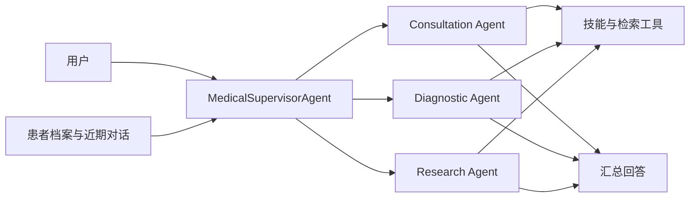

# Medical Agent Assistant

医疗多智能体助手与 Qwen3.5-2B 医疗模型训练实验。支持多轮问诊、专业 Agent 调度、患者档案和检索证据管理，并提供 CPT、LoRA SFT、GSPO 训练与可追溯评测。

更新于 **2026-09-09**：同步证据核对、工具调用协议和跨会话记忆改进；展示调度效率、检索覆盖与模型训练的关键结果。

[Agent 使用说明](medix-agent-swarm/README.md) · [训练与推理](MediX-R1/README.md) · [精选测评与证据](results/README.md) · [模型与数据](https://huggingface.co/collections/starttoshow/medix-medical-sft-and-gspo-6a9e6f31b80642f4ba8b6f28)

## 功能

| 模块 | 功能 |
| --- | --- |
| 医疗 Agent | Supervisor 根据问题调用问诊、诊断、研究 Agent，汇总工具结果和来源 |
| 记忆与检索 | 模型提议档案更新，代码校验用户和原话证据；近期对话预算、可选 Mem0 与主动历史补查；RAG 候选和正文复用 |
| 模型训练 | Qwen3.5-2B 的 Attention / Attention+FFN LoRA、VQA GSPO，以及 CPT→SFT→知识/病例 GSPO 对照链 |
| 评测 | 逐轮回答/档案/工具状态核对、逐项双评、串并行对照、答案与解释分评、配对置信区间 |

项目包含两条可独立运行的工程链路：通过 OpenAI 兼容 API 驱动的医疗 Agent，以及 Qwen3.5-2B 的 LoRA 训练与推理。

**关键设计：** Supervisor 按任务依赖调度专业 Agent，并核对 Worker 返回的实际检索摘录。患者档案、近期对话和 Mem0 历史共同提供上下文；新记忆附带有长度上限的用户原话，区分事件时间与保存时间。同一 Worker 内复用重复请求和文档正文，工具次数可配置，默认开放，保留轮数和超时边界。



## 快速开始

需要 Python 3.11+ 和可用的 OpenAI 兼容 API。以下为 PowerShell 命令：

```powershell
git clone https://github.com/qhzeng-gittec/medical-agent-assistant.git
cd medical-agent-assistant
python -m venv .venv
.\.venv\Scripts\Activate.ps1
python -m pip install -r medix-agent-swarm/requirements.txt -r requirements-dev.txt
Copy-Item config.example.py config.py
$env:LLM_API_KEY = "你的 API key"
$env:LLM_MODEL = "你的模型 ID"
$env:LLM_BASE_URL = "你的 OpenAI 兼容 API 地址"
python medix-agent-swarm/main.py
```

需要检索的问诊还需配置 Milvus、嵌入模型和知识库，见 [Agent 安装说明](medix-agent-swarm/README.md)。示例资料为合成技术文本。Linux/macOS 的环境设置与离线演示也见该文档。

## 关键测评

### Agent 调度效率

在固定的诊断、问诊和研究三个独立任务上，使用 **MiniMax M2.5 作为被测 Agent 模型**，串行与并行各执行 3 次。Worker 批次平均耗时由 **49.80 秒降至 20.15 秒，缩短 59.5%**。计时覆盖子任务执行阶段，总控规划和汇总另计。

两组使用同一模型、同一批任务，只改变调度方式；这是调度耗时对照。完整流程的请求数、费用和耗时另见 [架构测评](results/2026-09-08/architecture.md)。

### RAG 证据覆盖

在 **1,016 篇 MedlinePlus 健康主题摘要、800 条查询**的固定数据上，以 **Qwen3-Embedding-8B 生成检索向量**，按预先标注的目标来源直接计算覆盖，无需回答评分模型。测试集有 432 条完全可回答查询，保持同一排名，只改变返回的候选数量：

| 检索配置 | 完整目标来源覆盖 | 覆盖率 |
| --- | ---: | ---: |
| Top 1 | 333/432 | 77.1% |
| Top 3 | **408/432** | **94.4%** |
| Top 5 | 421/432 | 97.5% |

Top 3 比 Top 1 多覆盖 **75 个问题所需的全部来源**，说明保留多个候选能更好地支持多证据问题。统计使用无相似度过滤的固定排序，衡量检索覆盖；资料来自公开摘要，查询为合成检索任务。[数据、排名与复算](results/hybrid-grounding-2026-09-08/retrieval/summary.json)

### 状态、记忆与工具执行

实现包含患者档案与用户隔离、近期对话预算、Mem0 原话回查、事件时间保留、实际证据交付，以及重复请求和文档正文复用。这些机制通过 **104 项 Agent 测试和 48 项评测运行器测试**验证，覆盖本地存储重开、作用域隔离、工具协议和上下文处理；网络输出使用确定性测试替身。

[实现与运行说明](medix-agent-swarm/README.md) · [回归测试代码](medix-agent-swarm/tests/)

### 模型训练与通用基准

模型训练使用 **Qwen3.5-2B**，产物为 CPT、LoRA SFT 和 GSPO 各阶段权重。这里评测训练后的模型；前面的 MiniMax 是 Agent 调度实验的被测模型，Qwen3-Embedding-8B 是检索编码器，三者承担不同任务。

使用原始 Qwen3.5-2B 与医学 CPT+SFT（`cpt_medical_v1`）在三个通用基准各 **500 道固定抽样题**上配对比较，共 **1,500 道独立题**：

| 基准与零样本候选似然指标 | 原始模型 | CPT+SFT | 变化（百分点） | 配对 95% 区间 |
| --- | ---: | ---: | ---: | --- |
| MMLU 子集 · `acc` | 61.2% | 59.0% | −2.2 | [−5.6, +1.4] |
| ARC-Challenge · `acc_norm` | 44.2% | **51.2%** | **+7.0** | **[+3.8, +10.2]** |
| HellaSwag · `acc_norm` | 65.8% | 67.4% | +1.6 | [−0.6, +3.8] |

ARC-Challenge 的改善经三项主检验 Holm 校正后达到统计显著，另两项差值区间包含零。MMLU 排除六个医学科目；这是单训练种子和固定子集结果。[三项基准与离线复算](results/general-benchmarks-2026-09-08/README.md)

## 模型与数据

数据包含 **5,418 条训练、503 条验证、514 条测试记录及 314 张图片**，来自 VQA-RAD、MedMCQA、PubMedQA，含模型辅助标注。[数据来源与许可证](https://huggingface.co/datasets/starttoshow/medix-medical-sft)

已发布 A–F 六种 LoRA 配方、VQA GSPO 适配器，以及 [CPT→SFT→GSPO 四阶段权重链](https://huggingface.co/starttoshow/medix-qwen3.5-2b-cpt-sft-gspo-20260908)。权重链需按 CPT、SFT、RL 的依赖顺序合并，不能把后段适配器直接挂到原始基座；固定版本、哈希、配方和加载命令集中在 [训练与推理说明](MediX-R1/README.md)。

## 项目结构

```text
medical-agent-assistant/
├── medix-agent-swarm/    # Agent、技能、记忆、检索、示例与测试
├── MediX-R1/            # 训练、数据处理、评测与实验报告
├── results/             # 完整评测索引、汇总指标与复算工具
├── release/             # Hugging Face 产物上传工具
├── config.example.py    # API 与可选 Mem0 配置
└── requirements-dev.txt # 测试依赖
```

## 使用范围

项目用于研究和工程实验，尚未经过独立临床验证，不能替代专业诊疗。评测场景为合成资料或公开数据改编；上游来源与许可证随数据保留。运行时的密钥、患者档案和数据库应保存在各自的部署环境中。
