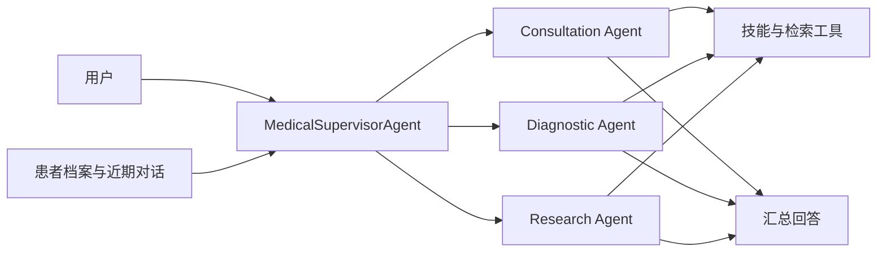

# Medical Agent Assistant

医疗多智能体助手与 Qwen3.5-2B 医疗模型训练实验。支持多轮问诊、专业 Agent 调度、患者档案和检索证据管理，并提供 CPT、LoRA SFT、GSPO 训练与可追溯评测。

更新于 **2026-09-09**：同步证据核对、工具调用协议和跨会话记忆改进；展示已完成的系统回归、混合检索及模型关键测评。

[Agent 使用说明](medix-agent-swarm/README.md) · [训练与推理](MediX-R1/README.md) · [精选测评与证据](results/README.md) · [模型与数据](https://huggingface.co/collections/starttoshow/medix-medical-sft-and-gspo-6a9e6f31b80642f4ba8b6f28)

## 功能

| 模块 | 功能 |
| --- | --- |
| 医疗 Agent | Supervisor 根据问题调用问诊、诊断、研究 Agent，汇总工具结果和来源 |
| 记忆与检索 | 模型提议档案更新，代码校验用户和原话证据；近期对话预算、可选 Mem0 与主动历史补查；RAG 候选和正文复用 |
| 模型训练 | Qwen3.5-2B 的 Attention / Attention+FFN LoRA、VQA GSPO，以及 CPT→SFT→知识/病例 GSPO 对照链 |
| 评测 | 逐轮回答/档案/工具状态核对、逐项双评、串并行对照、答案与解释分评、配对置信区间 |

项目包含两条可独立运行的工程链路：通过 OpenAI 兼容 API 驱动的医疗 Agent，以及 Qwen3.5-2B 的 LoRA 训练与推理。

**关键设计：** Supervisor 按任务依赖调度专业 Agent，并核对 Worker 返回的实际检索摘录。患者档案、近期对话和 Mem0 历史共同提供上下文；新记忆附带有长度上限的用户原话，区分事件时间与保存时间。同一 Worker 内复用重复请求和文档正文，工具次数可配置，默认开放，保留轮数和超时边界。



## 快速开始

需要 Python 3.11+ 和可用的 OpenAI 兼容 API。以下为 PowerShell 命令：

```powershell
git clone https://github.com/qhzeng-gittec/medical-agent-assistant.git
cd medical-agent-assistant
python -m venv .venv
.\.venv\Scripts\Activate.ps1
python -m pip install -r medix-agent-swarm/requirements.txt -r requirements-dev.txt
Copy-Item config.example.py config.py
$env:LLM_API_KEY = "你的 API key"
$env:LLM_MODEL = "你的模型 ID"
$env:LLM_BASE_URL = "你的 OpenAI 兼容 API 地址"
python medix-agent-swarm/main.py
```

需要检索的问诊还需配置 Milvus、嵌入模型和知识库，见 [Agent 安装说明](medix-agent-swarm/README.md)。示例资料为合成技术文本。Linux/macOS 的环境设置与离线演示也见该文档。

## 关键测评

### Agent、检索与跨会话记忆

| 设计与任务 | 关键结果 | 测量范围 |
| --- | --- | --- |
| 独立 Worker 条件并行 | 平均 **49.80 → 20.15 秒，缩短 59.5%** | 固定三个任务，MiniMax M2.5，串/并行各 3 次；只计子任务阶段 |
| 原话回查与事件时间保留 | 历史回归 **64/72 → 67/72**；新增验证 **8/12 → 11/12** | Qwen3.5-27B，两版共 168 次执行；72 场景中有 70 个有效双评配对，63→66，p=0.508 |
| 多语言混合检索实验 | 纯向量 → 翻译查询 + BM25/向量 RRF，完整来源覆盖 @3 **408/432 → 410/432** | 1,016 篇语料、800 查询；参数只在开发集选择，增益区间包含零 |
| 检索后的最终回答 | 纯向量 / 混合检索的评审完整正确数 **621/640、625/640** | 相同测试查询与证据约束提示，另公开评审误判和同上下文生成波动 |
| 本地 Mem0 历史问答 | 历史问题 **177/192**；历史与缺失信息组合问题 **89/96** | 96 个测试用户，基于实际存储重开后的召回；MiniMax M2.5 按原始会话评分 |

记忆结果是针对具体缺陷的回归证据，包含退步项和评分缺失，尚未证明整体能力稳定提升；新增验证也有日期口径及判分问题，报告逐例保留。此前证据与工具改动的 66 场景回归为 **56/66→55/66**，不能将局部设计改进等同于整体通过率上升。

检索覆盖与回答质量分别统计；混合检索是可运行的快照实验，产品默认检索仍使用 Milvus。以上均为合成场景或公开资料改编任务的模型辅助评测。

[记忆改进、系统回归与逐场证据](results/memory-2026-09-09/README.md) · [混合检索与回答完整测评](results/hybrid-grounding-2026-09-08/README.md) · [并行与完整架构对照](results/2026-09-08/architecture.md)

### 模型训练与通用基准

训练围绕 Qwen3.5-2B 的 CPT、LoRA SFT 和 GSPO 展开，分别检查知识调用、不同问法的一致性和强化学习反馈。Agent 的 API 模型评测与本节微调权重评测独立。

| 阶段对照 | 关键结果 | 解读条件 |
| --- | --- | --- |
| 直接 SFT → CPT+SFT，150 知识题 | 答案严格正确 **88/150 → 89/150**；答案与解释均正确 **71/150 → 77/150** | 两项配对区间均包含零，尚无明确整体增益 |
| CPT → CPT+SFT，91 个事实族各两种问法 | 两问均正确 **38/91 → 48/91** | +10.99 个百分点，95% CI [+1.10, +19.78]；45 族来自训练、46 族来自 validation |
| 同一参考骨干关闭 / 开启 GSPO，312 知识与病例题 | 答案严格正确 **134/312 → 132/312** | 差值区间包含零；训练题上的改善未转化为该任务集增益 |

上述知识题含 CPT 选材中的项目知识，属于受控知识获取与调用分析；各对照使用其冻结的生成预算，单训练种子。[阶段分析与逐题记录](results/2026-09-08/model_diagnostics.md)

另用原始 Qwen3.5-2B 与医学 CPT+SFT（`cpt_medical_v1`）在三个通用基准各 **500 道固定抽样题**上配对比较，共 **1,500 道独立题**：

| 基准与零样本候选似然指标 | 原始模型 | CPT+SFT | 变化（百分点） | 配对 95% 区间 |
| --- | ---: | ---: | ---: | --- |
| MMLU 子集 · `acc` | 61.2% | 59.0% | −2.2 | [−5.6, +1.4] |
| ARC-Challenge · `acc_norm` | 44.2% | **51.2%** | **+7.0** | **[+3.8, +10.2]** |
| HellaSwag · `acc_norm` | 65.8% | 67.4% | +1.6 | [−0.6, +3.8] |

ARC-Challenge 的改善经三项主检验 Holm 校正后达到统计显著，另两项差值区间包含零。MMLU 排除六个医学科目；这是单训练种子和固定子集结果。[三项基准与离线复算](results/general-benchmarks-2026-09-08/README.md)

## 模型与数据

数据包含 **5,418 条训练、503 条验证、514 条测试记录及 314 张图片**，来自 VQA-RAD、MedMCQA、PubMedQA，含模型辅助标注。[数据来源与许可证](https://huggingface.co/datasets/starttoshow/medix-medical-sft)

已发布 A–F 六种 LoRA 配方、VQA GSPO 适配器，以及 [CPT→SFT→GSPO 四阶段权重链](https://huggingface.co/starttoshow/medix-qwen3.5-2b-cpt-sft-gspo-20260908)。权重链需按 CPT、SFT、RL 的依赖顺序合并，不能把后段适配器直接挂到原始基座；固定版本、哈希、配方和加载命令集中在 [训练与推理说明](MediX-R1/README.md)。

## 项目结构

```text
medical-agent-assistant/
├── medix-agent-swarm/    # Agent、技能、记忆、检索、示例与测试
├── MediX-R1/            # 训练、数据处理、评测与实验报告
├── results/             # 完整评测索引、汇总指标与复算工具
├── release/             # Hugging Face 产物上传工具
├── config.example.py    # API 与可选 Mem0 配置
└── requirements-dev.txt # 测试依赖
```

## 使用范围

项目用于研究和工程实验，尚未经过独立临床验证，不能替代专业诊疗。评测场景为合成资料或公开数据改编；上游来源与许可证随数据保留。运行时的密钥、患者档案和数据库应保存在各自的部署环境中。
