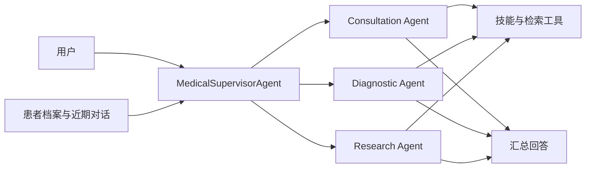

# Medical Agent Assistant

医疗多智能体助手与 Qwen3.5-2B 医疗模型训练实验。支持多轮问诊、专业 Agent 调度、患者档案和检索证据管理，并提供 CPT、LoRA SFT、GSPO 训练与可追溯评测。

更新于 **2026-09-08**：Agent 评测按关键设计、实测结果与测量方法整理；提供 72 场景整体验收、架构对照及 CPT→SFT→GSPO 阶段诊断。

[Agent 使用说明](medix-agent-swarm/README.md) · [训练与推理](MediX-R1/README.md) · [Agent 设计与测评](results/2026-09-08/agent_improvements.md) · [评测数据](results/2026-09-08/README.md) · [历史评测](results/README.md) · [模型与数据](https://huggingface.co/collections/starttoshow/medix-medical-sft-and-gspo-6a9e6f31b80642f4ba8b6f28)

## 功能

| 模块 | 功能 |
| --- | --- |
| 医疗 Agent | Supervisor 根据问题调用问诊、诊断、研究 Agent，汇总工具结果和来源 |
| 记忆与检索 | 模型提议档案更新，代码校验用户和原话证据；近期对话预算、可选 Mem0 与主动历史补查；RAG 候选和正文复用 |
| 模型训练 | Qwen3.5-2B 的 Attention / Attention+FFN LoRA、VQA GSPO，以及新增 CPT→SFT→知识/病例 GSPO 对照链 |
| 评测 | 逐轮回答/档案/工具状态核对、分母与缺失评分、串并行对照、答案与解释分评、配对置信区间 |

Agent 使用 OpenAI 兼容 API；LoRA 模型训练与推理独立运行，尚未验证微调模型接入 Agent 后的端到端收益。



## 快速开始

需要 Python 3.11+ 和可用的 OpenAI 兼容 API。以下为 PowerShell 命令：

```powershell
git clone https://github.com/qhzeng-gittec/medical-agent-assistant.git
cd medical-agent-assistant
python -m venv .venv
.\.venv\Scripts\Activate.ps1
python -m pip install -r medix-agent-swarm/requirements.txt -r requirements-dev.txt
Copy-Item config.example.py config.py
$env:LLM_API_KEY = "你的 API key"
$env:LLM_MODEL = "你的模型 ID"
$env:LLM_BASE_URL = "你的 OpenAI 兼容 API 地址"
python medix-agent-swarm/main.py
```

需要检索的问诊还需配置 Milvus、嵌入模型和知识库，见 [Agent 安装说明](medix-agent-swarm/README.md)。示例资料为合成技术文本。Linux/macOS 的环境设置与离线演示也见该文档。

## 模型与数据

数据集包含 5,418 条训练记录、503 条验证记录、514 条测试记录和 314 张图片，来源为 VQA-RAD、MedMCQA、PubMedQA。推理标注包含模型辅助生成内容；来源、处理方法和许可证见 [数据集页面](https://huggingface.co/datasets/starttoshow/medix-medical-sft)。

| 产物 | 内容 |
| --- | --- |
| [训练数据](https://huggingface.co/datasets/starttoshow/medix-medical-sft) | 6,435 条记录、314 张图片、4 种训练配方 |
| [A](https://huggingface.co/starttoshow/medix-qwen3.5-2b-vqa-attention) | VQA · Attention |
| [B](https://huggingface.co/starttoshow/medix-qwen3.5-2b-vqa-attention-ffn) | VQA · Attention + FFN |
| [C](https://huggingface.co/starttoshow/medix-qwen3.5-2b-knowledge-attention) | VQA + 知识 · Attention |
| [D](https://huggingface.co/starttoshow/medix-qwen3.5-2b-knowledge-attention-ffn) | VQA + 知识 · Attention + FFN |
| [E](https://huggingface.co/starttoshow/medix-qwen3.5-2b-case-attention-ffn) | VQA + 知识 + 病例 · Attention + FFN |
| [F](https://huggingface.co/starttoshow/medix-qwen3.5-2b-context-attention-ffn) | VQA + 知识 + 病例 + 上下文 · Attention + FFN |
| [GSPO](https://huggingface.co/starttoshow/medix-qwen3.5-2b-vqa-gspo) | 基于 C 组继续训练的完整适配器 |

七份权重均为 LoRA 适配器，加载时需要 Qwen3.5-2B 基座。[训练说明](MediX-R1/README.md)提供固定版本的数据下载、适配器推理和训练命令；版本与哈希见 [产物清单](MediX-R1/configs/artifacts.json)。


### 新增：CPT→SFT→GSPO 实验权重链

[medix-qwen3.5-2b-cpt-sft-gspo-20260908](https://huggingface.co/starttoshow/medix-qwen3.5-2b-cpt-sft-gspo-20260908) 包含 `cpt/`、`sft/`、`sft_only/`、`rl/` 四组权重与 `release_manifest.json`。其中 SFT 依赖已合并 CPT，RL 依赖依次合并 CPT 和 SFT；不能将后两者直接挂到原始基座。保留旧 A–F/VQA GSPO 作为历史对照，新增链不宣称优于所有旧模型。

按 [新版模型加载说明](MediX-R1/README.md#新增-cptsftgspo-实验链)加载，固定 revision、SHA-256 和 BF16 合并顺序。模型尚未接入本页 Agent 实测。

## 评测结果

数字按实验、独立场景和执行次数分别报告。自动评审、规则检查及执行完成均不等于临床诊断准确率；Agent 与微调模型尚未完成接入后的端到端收益验证。

### 1. Agent：关键设计与实测结果

Supervisor 负责分派和汇总，专业 Worker 执行问诊、诊断与资料检索；患者档案、近期对话和历史检索共同提供上下文。下面按设计说明已有证据，详细报告给出对照条件、计算方法和原始记录入口。

| 关键设计 | 测得的结果 | 怎么测的 |
| --- | --- | --- |
| 独立 Worker 条件并行 | 子任务阶段平均 **49.80 → 20.15 秒，缩短 59.5%** | 固定同样的三个任务，真实 MiniMax M2.5，串行/并行各 3 次；不含总控规划与汇总 |
| RAG 保留多个证据候选 | Top 1 → Top 3，完整证据覆盖 **33/40 → 39/40（+15 个百分点）** | 15 个文档块、40 个可回答检索问题；固定向量排序与阈值，检查预标注的全部必需证据组 |
| 分层记忆与主动历史补查 | 四类历史信息覆盖：Qwen、Gemini **2/4 → 4/4**；MiniMax **2/4 → 2/4** | 同一合成场景、每模型每配置 1 次；初始召回缺两类信息，核对补查工具轨迹和最终回答；属于场景观察 |
| 同一 Worker 内证据复用 | **2 次相同请求只执行 1 次底层查询**；重复文档用引用代替正文 | 确定性组件测试，检查底层调用次数及模型实际收到的消息；未测得全流程 Token 节省率 |
| 工具预算由执行层强制控制 | **161/161 次超预算调用提议被拒绝，未观察到越预算执行** | 审计 277 组已完成运行，将正式工具调用与当轮工具声明、执行结果配对；分母是调用提议数 |

这些数字分别来自并发对照、检索组件实验、单场景观察和执行轨迹审计，不能相加为一个“Agent 准确率”。[关键设计与测评方法](results/2026-09-08/agent_improvements.md)

**完整流程的代价也做了对照。** 在 8 个开发场景、两种架构各重复 2 次的 32 组执行中，单 Agent / 多 Agent 的平均案例耗时为 **17.82 / 37.05 秒**，模型请求总数为 **33 / 89**，本批模型与检索费用为 **$0.0168 / $0.0522**。因此当前实现的并行收益限于子任务阶段，尚未测出端到端提速；质量评分仅完成 17/32，不能证明多 Agent 更准。[架构对照方法](results/2026-09-08/architecture.md)

### 2. Agent：整体验收如何测

使用 **72 个新编合成场景**：问诊、历史记忆、证据使用各 24 个，每类再分常规、复杂、边界各 8 个。三款模型各执行一遍，共 216 组；MiniMax、Qwen、Gemini 分别完成 **69/72、69/72、68/72**。另外预选 18 个场景做重复执行；包含重复后的 324 组计划中，实际尝试 300 组、完成 277 组、执行未完成 23 组、未启动 24 组。独立场景数仍为 72。

每个场景预先规定要检查的行为，例如是否保留用户更正、是否真的更新档案、引用是否得到工具返回内容支持。运行器保存逐轮回答、前后档案和工具轨迹，再由两款模型匿名逐项评审；分歧记为不确定，评分错误与未评分单列。**执行成功只说明流程跑完，全部检查通过也不等于临床准确率。** 双评尚未全部完成，当前不据此给模型排名。

[完整测评方法与评分表](results/2026-09-08/agent_holdout.md)说明样本构成、真实/受控服务范围、评分规则和各项分母；[结果附件与复算](results/2026-09-08/README.md)提供原始记录。

### 3. 模型：CPT→SFT→GSPO 的收益与退步

新增链使用 Qwen3.5-2B：CPT rank 32 / 1,252 步 / 8,081,502 token；Attention SFT rank 8 / 1,355 步；Attention+FFN GSPO rank 8 / 320 步。GSPO 的 **128 个训练问题 × 5 轮 × 4 候选 = 2,560 次采样**，并非 2,560 个独立问题。

| 对照与指标 | 之前 → 之后 | 配对变化与解释 |
| --- | ---: | --- |
| 150 知识题：直接 SFT → CPT+SFT，答案严格正确 | 88/150 → 89/150 | +0.67 个百分点，95% CI [−5.33, +6.67]；10 改对 / 9 改错 |
| 同 150 题：答案与解释均正确 | 71/150 → 77/150 | +4.00 个百分点，95% CI [−2.02, +10.67] |
| 91 个事实族、每族两种问法：CPT → CPT+SFT，两问均正确 | 38/91 → 48/91 | +10.99 个百分点，95% CI [+1.10, +19.78]；45 族来自训练、46 族来自 validation |
| 312 知识/病例题：同一合并参考骨干，仅关闭/开启 RL，答案严格正确 | 134/312 → 132/312 | −0.64 个百分点，95% CI [−2.56, +1.28]；4 改对 / 6 改错 |
| 冻结 128 个 RL 训练题：第 0 → 5 轮，贪心答案严格正确 | 79/128 → 84/128 | 5 改对 / 0 改错；精确 McNemar p=0.0625，属于训练题诊断 |
| 同 128 题：8 次采样至少一次答案正确 | 109/128 → 108/128 | 候选存在性指标，需要另有选择器才能变成单次回答收益 |

这些实验只有一个训练种子；区间为探索性名义配对区间，没有全面多重比较校正。**150/312 题包含曾参与 CPT 选材的项目知识，属于受控知识获取与调用诊断，不是全新未见知识泛化测试。** 150 题对照采用 2,048 token；312 题机制对照采用 512 总 token / 384 思考预算，绝对分数不可直接横比。

结论是：SFT 后存在局部知识调用改善，当前 GSPO 未证明完整知识/病例题的可靠净收益。进一步审查发现奖励对部分错误解释区分不足，且补充正确前提的表面提升常含答案泄露：73 个机器初判“不含答案”的前提中，人工式复查发现 57 个直接给答案、5 个部分提示，仅 11 个无明确目标。不能把 oracle 提示成绩当作模型自主推理能力。[阶段诊断与冻结 RL 明细](results/2026-09-08/model_diagnostics.md)

### 4. 历史对照与尚未收尾的实验

| 实验 | 范围与结果 | 证据 |
| --- | --- | --- |
| A–F LoRA 项目留出 | 150 知识 + 97 上下文题，944 份回答；知识数据与 FFN 的稳定净收益尚不确定 | [训练报告](MediX-R1/reports/training_report.md) |
| 旧 VQA GSPO | 93 道验证题、16 张图；归一化自动评审分 60.75 → 66.13；9 改善 / 2 退步 / 82 同分，单种子 | [配对明细](MediX-R1/reports/gspo_comparison.json) |
| 新 600 题原始选择题评测 | 四组旧权重生成完成；4 题输入缺失，语义评分快照仅 30/596；保留原标签分，不作为新版模型总成绩 | [状态与口径](results/2026-09-08/training/medical_holdout600_v1/semantic_scoring_status.json) |

[9 月 8 日结果索引与校验](results/2026-09-08/README.md)提供本次机器可读汇总、逐题/逐场景状态和文件哈希；[9 月 7 日历史附件](results/README.md)继续保留。当前项目的可展示贡献是状态与证据边界、可复现对照及错误定位，尚未完成临床验证。

## 项目结构

```text
medical-agent-assistant/
├── medix-agent-swarm/    # Agent、技能、记忆、检索、示例与测试
├── MediX-R1/            # 训练、数据处理、评测与实验报告
├── results/             # 完整评测索引、汇总指标与复算工具
├── release/             # Hugging Face 产物上传工具
├── config.example.py    # API 与可选 Mem0 配置
└── requirements-dev.txt # 测试依赖
```

## 使用范围

项目用于研究和工程实验，尚未经过独立临床验证，不能替代专业诊疗。评测场景为合成资料或公开数据改编；上游来源与许可证随数据保留。运行时的密钥、患者档案和数据库应保存在各自的部署环境中。
