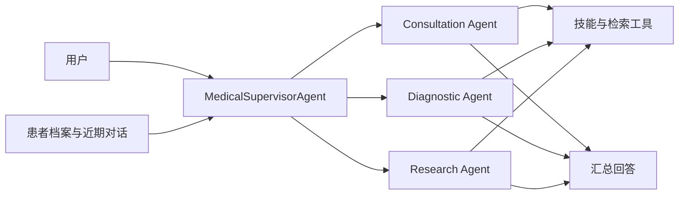

# Medical Agent Assistant

医疗多智能体助手与 Qwen3.5-2B 医疗模型训练实验。支持多轮问诊、专业 Agent 调度、患者档案和检索证据管理，并提供 LoRA SFT、GSPO 训练及评测代码。

[Agent 使用说明](medix-agent-swarm/README.md) · [训练与推理](MediX-R1/README.md) · [完整评测结果](results/README.md) · [完整评测结果](results/README.md) · [模型与数据](https://huggingface.co/collections/starttoshow/medix-medical-sft-and-gspo-6a9e6f31b80642f4ba8b6f28)

## 功能

| 模块 | 功能 |
| --- | --- |
| 医疗 Agent | Supervisor 根据问题调用问诊、诊断、研究 Agent，汇总工具结果和来源 |
| 记忆与检索 | 患者档案持久化、近期对话预算、可选 Mem0、Milvus 检索与证据正文复用 |
| 模型训练 | Qwen3.5-2B 的 Attention / Attention+FFN LoRA，以及 VQA GSPO 实验 |
| 评测 | Agent 开发场景、组件测试、医疗问答评分和配方对照 |

Agent 使用 OpenAI 兼容 API；LoRA 模型训练与推理独立运行，尚未验证微调模型接入 Agent 后的端到端收益。



## 快速开始

需要 Python 3.11+ 和可用的 OpenAI 兼容 API。以下为 PowerShell 命令：

```powershell
git clone https://github.com/qhzeng-gittec/medical-agent-assistant.git
cd medical-agent-assistant
python -m venv .venv
.\.venv\Scripts\Activate.ps1
python -m pip install -r medix-agent-swarm/requirements.txt -r requirements-dev.txt
Copy-Item config.example.py config.py
$env:LLM_API_KEY = "你的 API key"
$env:LLM_MODEL = "你的模型 ID"
$env:LLM_BASE_URL = "你的 OpenAI 兼容 API 地址"
python medix-agent-swarm/main.py
```

需要检索的问诊还需配置 Milvus、嵌入模型和知识库，见 [Agent 安装说明](medix-agent-swarm/README.md)。示例资料为合成技术文本。Linux/macOS 的环境设置与离线演示也见该文档。

## 模型与数据

数据集包含 5,418 条训练记录、503 条验证记录、514 条测试记录和 314 张图片，来源为 VQA-RAD、MedMCQA、PubMedQA。推理标注包含模型辅助生成内容；来源、处理方法和许可证见 [数据集页面](https://huggingface.co/datasets/starttoshow/medix-medical-sft)。

| 产物 | 内容 |
| --- | --- |
| [训练数据](https://huggingface.co/datasets/starttoshow/medix-medical-sft) | 6,435 条记录、314 张图片、4 种训练配方 |
| [A](https://huggingface.co/starttoshow/medix-qwen3.5-2b-vqa-attention) | VQA · Attention |
| [B](https://huggingface.co/starttoshow/medix-qwen3.5-2b-vqa-attention-ffn) | VQA · Attention + FFN |
| [C](https://huggingface.co/starttoshow/medix-qwen3.5-2b-knowledge-attention) | VQA + 知识 · Attention |
| [D](https://huggingface.co/starttoshow/medix-qwen3.5-2b-knowledge-attention-ffn) | VQA + 知识 · Attention + FFN |
| [E](https://huggingface.co/starttoshow/medix-qwen3.5-2b-case-attention-ffn) | VQA + 知识 + 病例 · Attention + FFN |
| [F](https://huggingface.co/starttoshow/medix-qwen3.5-2b-context-attention-ffn) | VQA + 知识 + 病例 + 上下文 · Attention + FFN |
| [GSPO](https://huggingface.co/starttoshow/medix-qwen3.5-2b-vqa-gspo) | 基于 C 组继续训练的完整适配器 |

七份权重均为 LoRA 适配器，加载时需要 Qwen3.5-2B 基座。[训练说明](MediX-R1/README.md)提供固定版本的数据下载、适配器推理和训练命令；版本与哈希见 [产物清单](MediX-R1/configs/artifacts.json)。

## 评测结果

| 实验 | 范围与结果 | 详细报告 |
| --- | --- | --- |
| LoRA 留出评测 | 247 道知识/上下文题，944 份回答；加入知识后的净收益未获得稳定证据 | [训练报告](MediX-R1/reports/training_report.md) |
| GSPO | 93 道验证题、16 张图像；归一化评审分 60.75 → 66.13，单训练种子 | [GSPO 对比](MediX-R1/reports/gspo_comparison.json) |
| Agent 开发评测 | 24 个模拟场景 × 2 款模型；48 个主任务完成，自动双评审有效 96/96 条 | [开发测评报告](medix-agent-swarm/reports/医疗问诊Agent测评报告.md) |

上述评审分不等于临床诊断准确率。Agent 两位评审均全项通过的任务为 MiniMax 13/24、Qwen 14/24，不能据此推断临床优劣。[完整评测结果](results/README.md)提供逐题评分、必要轨迹、历史实验附件及复算脚本；报告保留风险判断、档案写入和子 Agent 失败问题。

## 项目结构

```text
medical-agent-assistant/
├── medix-agent-swarm/    # Agent、技能、记忆、检索、示例与测试
├── MediX-R1/            # 训练、数据处理、评测与实验报告
├── results/             # 完整评测索引、汇总指标与复算工具
├── release/             # Hugging Face 产物上传工具
├── config.example.py    # API 与可选 Mem0 配置
└── requirements-dev.txt # 测试依赖
```

## 使用范围

项目用于研究和工程实验，尚未经过独立临床验证，不能替代专业诊疗。评测场景为合成资料或公开数据改编；上游来源与许可证随数据保留。运行时的密钥、患者档案和数据库应保存在各自的部署环境中。
