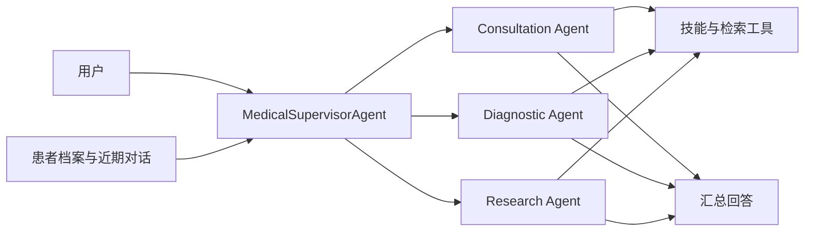

# Medical Agent Assistant

医疗多智能体助手与 Qwen3.5-2B 医疗模型训练实验。支持多轮问诊、专业 Agent 调度、患者档案和检索证据管理，并提供 CPT、LoRA SFT、GSPO 训练与可追溯评测。

更新于 **2026-09-08**：新增 **400 条 RAG 查询 / 1,016 篇语料**与 **120 个 Mem0 跨会话场景**的独立测评，公开数据、脚本、真实 API 结果与离线复算材料；同时提供 Agent 整体验收、架构对照及 CPT→SFT→GSPO 阶段评测。

[Agent 使用说明](medix-agent-swarm/README.md) · [训练与推理](MediX-R1/README.md) · [Agent 设计与测评](results/2026-09-08/agent_improvements.md) · [RAG / Mem0 独立测评](results/component-benchmark-2026-09-08/README.md) · [评测数据](results/2026-09-08/README.md) · [历史评测](results/README.md) · [模型与数据](https://huggingface.co/collections/starttoshow/medix-medical-sft-and-gspo-6a9e6f31b80642f4ba8b6f28)

## 功能

| 模块 | 功能 |
| --- | --- |
| 医疗 Agent | Supervisor 根据问题调用问诊、诊断、研究 Agent，汇总工具结果和来源 |
| 记忆与检索 | 模型提议档案更新，代码校验用户和原话证据；近期对话预算、可选 Mem0 与主动历史补查；RAG 候选和正文复用 |
| 模型训练 | Qwen3.5-2B 的 Attention / Attention+FFN LoRA、VQA GSPO，以及新增 CPT→SFT→知识/病例 GSPO 对照链 |
| 评测 | 逐轮回答/档案/工具状态核对、逐项双评、串并行对照、答案与解释分评、配对置信区间 |

项目包含两条可独立运行的工程链路：通过 OpenAI 兼容 API 驱动的医疗 Agent，以及 Qwen3.5-2B 的 LoRA 训练与推理。

**当前实现：** Supervisor 结合完整语义和任务依赖决定分派、并行与补查；专业 Agent 返回实际证据，执行层约束工具调用和用户范围。跨会话记忆采用 **Mem0 OSS + 本地 Qdrant / SQLite**，由 Qwen3.5-27B 抽取事实、Qwen3-Embedding-8B 生成向量。当前标注与自动评审入口已接入 **GPT-5.5 / Codex CLI**；下方冻结测评按原始记录标注模型和参数，便于复算对照。



## 快速开始

需要 Python 3.11+ 和可用的 OpenAI 兼容 API。以下为 PowerShell 命令：

```powershell
git clone https://github.com/qhzeng-gittec/medical-agent-assistant.git
cd medical-agent-assistant
python -m venv .venv
.\.venv\Scripts\Activate.ps1
python -m pip install -r medix-agent-swarm/requirements.txt -r requirements-dev.txt
Copy-Item config.example.py config.py
$env:LLM_API_KEY = "你的 API key"
$env:LLM_MODEL = "你的模型 ID"
$env:LLM_BASE_URL = "你的 OpenAI 兼容 API 地址"
python medix-agent-swarm/main.py
```

需要检索的问诊还需配置 Milvus、嵌入模型和知识库，见 [Agent 安装说明](medix-agent-swarm/README.md)。示例资料为合成技术文本。Linux/macOS 的环境设置与离线演示也见该文档。

## 模型与数据

数据集包含 5,418 条训练记录、503 条验证记录、514 条测试记录和 314 张图片，来源为 VQA-RAD、MedMCQA、PubMedQA。推理标注包含模型辅助生成内容；来源、处理方法和许可证见 [数据集页面](https://huggingface.co/datasets/starttoshow/medix-medical-sft)。

| 产物 | 内容 |
| --- | --- |
| [训练数据](https://huggingface.co/datasets/starttoshow/medix-medical-sft) | 6,435 条记录、314 张图片、4 种训练配方 |
| [A](https://huggingface.co/starttoshow/medix-qwen3.5-2b-vqa-attention) | VQA · Attention |
| [B](https://huggingface.co/starttoshow/medix-qwen3.5-2b-vqa-attention-ffn) | VQA · Attention + FFN |
| [C](https://huggingface.co/starttoshow/medix-qwen3.5-2b-knowledge-attention) | VQA + 知识 · Attention |
| [D](https://huggingface.co/starttoshow/medix-qwen3.5-2b-knowledge-attention-ffn) | VQA + 知识 · Attention + FFN |
| [E](https://huggingface.co/starttoshow/medix-qwen3.5-2b-case-attention-ffn) | VQA + 知识 + 病例 · Attention + FFN |
| [F](https://huggingface.co/starttoshow/medix-qwen3.5-2b-context-attention-ffn) | VQA + 知识 + 病例 + 上下文 · Attention + FFN |
| [GSPO](https://huggingface.co/starttoshow/medix-qwen3.5-2b-vqa-gspo) | 基于 C 组继续训练的完整适配器 |

七份权重均为 LoRA 适配器，加载时需要 Qwen3.5-2B 基座。[训练说明](MediX-R1/README.md)提供固定版本的数据下载、适配器推理和训练命令；版本与哈希见 [产物清单](MediX-R1/configs/artifacts.json)。


### 新增：CPT→SFT→GSPO 实验权重链

[medix-qwen3.5-2b-cpt-sft-gspo-20260908](https://huggingface.co/starttoshow/medix-qwen3.5-2b-cpt-sft-gspo-20260908) 包含 `cpt/`、`sft/`、`sft_only/`、`rl/` 四组权重与 `release_manifest.json`。其中 SFT 依赖已合并 CPT，RL 依赖依次合并 CPT 和 SFT；不能将后两者直接挂到原始基座。A–F/VQA GSPO 与新增权重链分别提供训练配方和对应评测。

按 [新版模型加载说明](MediX-R1/README.md#新增-cptsftgspo-实验链)加载，固定 revision、SHA-256 和 BF16 合并顺序。本页 Agent 指标来自所标注的 API 模型，微调权重按独立模型任务评测。

## 评测结果

评测覆盖并行调度、证据检索、历史记忆、工具执行和模型训练。各项给出明确的对照、样本量与统计单位，便于从工程设计追溯到实测结果。

### 1. Agent：关键设计与实测结果

Supervisor 负责分派和汇总，专业 Worker 执行问诊、诊断与资料检索；患者档案、近期对话和历史检索共同提供上下文。下面按设计说明已有证据，详细报告给出对照条件、计算方法和原始记录入口。

| 关键设计 | 测得的结果 | 怎么测的 |
| --- | --- | --- |
| 独立 Worker 条件并行 | 子任务阶段平均 **49.80 → 20.15 秒，缩短 59.5%** | 固定同样的三个任务，真实 MiniMax M2.5，串行/并行各 3 次；不含总控规划与汇总 |
| RAG 保留多个证据候选 | Top 1 → Top 3，完整目标来源覆盖 **183/272 → 249/272（67.3% → 91.5%，+24.3 个百分点）** | 1,016 个 MedlinePlus 健康主题；冻结测试集 272 条可回答查询，固定真实 API 向量与阈值 0，要求全部目标来源组均命中 |
| Mem0 跨会话事实检索 | Top 3 → Top 10，全部预期事实获支持 **176/192 → 184/192（91.7% → 95.8%，+4.2 个百分点）**；未知用户 / 其他应用空返回各 **96/96** | 96 个测试场景、每场景两次会话；真实抽取后关闭并重开本地存储，阈值 0.3，逐事实语义评分附实际记忆原文 |
| 分层记忆与主动历史补查 | 四类历史信息覆盖：Qwen、Gemini **2/4 → 4/4**；MiniMax **2/4 → 2/4** | 同一合成场景、每模型每配置 1 次；初始召回缺两类信息，核对补查工具轨迹和最终回答；属于场景观察 |
| 同一 Worker 内证据复用 | **2 次相同请求只执行 1 次底层查询**；重复文档用引用代替正文 | 确定性组件测试，检查底层调用次数及模型实际收到的消息；统计范围为一次 Worker 调用 |
| 工具预算由执行层强制控制 | **161/161 次超预算调用提议被执行层拦截** | 审计 277 组已完成运行，将正式工具调用与当轮工具声明、执行结果配对；分母是调用提议数 |

指标按并发对照、检索组件实验、单场景观察和执行轨迹审计分别统计。[关键设计与测评方法](results/2026-09-08/agent_improvements.md)

**RAG 与 Mem0 已提供完整独立测评：** [400 条 RAG 查询与 120 个 Mem0 场景](results/component-benchmark-2026-09-08/README.md)。RAG 覆盖中英文检索、双来源组合、上下文配对与无答案查询；开发集选出的 0.5 阈值在测试集上让 **29/32** 条无答案查询返回空集，对应完整目标来源覆盖 **198/272**。Mem0 单列人物、时间、更正、否定及跨会话事实，并保留逐项评分的原文依据。

[RAG 报告与实际向量](results/component-benchmark-2026-09-08/rag/README.md) · [Mem0 报告与原始记录](results/component-benchmark-2026-09-08/memory/README.md) · [数据集、来源授权与运行脚本](medix-agent-swarm/evals/component_benchmark_v2/README.md)

**架构评测分为子任务阶段和完整流程。** 上表的 59.5% 为固定 Worker 批次的耗时改善；另以 8 个场景、两种架构各重复 2 次记录完整流程的耗时、请求数和费用，见 [32 组单/多 Agent 对照](results/2026-09-08/architecture.md)。

### 2. Agent：整体验收如何测

使用 **72 个新编合成场景**：问诊、历史记忆、证据使用各 24 个，每类再分常规、复杂、边界各 8 个。三款模型各执行一遍，共 216 组；MiniMax、Qwen、Gemini 分别完成 **69/72、69/72、68/72**。另外预选 18 个场景做重复执行；包含重复后的 324 组计划中，已形成 **300 组执行尝试、277 组完整运行记录**；详细执行状态见测评表。独立场景数为 72。

每个场景预先规定要检查的行为，例如是否保留用户更正、是否真的更新档案、引用是否得到工具返回内容支持。运行器保存逐轮回答、前后档案和工具轨迹，再由两款模型匿名逐项评审，分别统计运行完成度和任务检查通过情况。当前发布的是部分双评快照，各模型评分覆盖及待评项在详细报告中单列。

[完整测评方法与评分表](results/2026-09-08/agent_holdout.md)说明样本构成、真实/受控服务范围、评分规则和各项分母；[结果附件与复算](results/2026-09-08/README.md)提供原始记录。

### 3. 模型：CPT→SFT→GSPO 阶段评测

新增链使用 Qwen3.5-2B：CPT rank 32 / 1,252 步 / 8,081,502 token；Attention SFT rank 8 / 1,355 步；Attention+FFN GSPO rank 8 / 320 步。GSPO 的 **128 个训练问题 × 5 轮 × 4 候选 = 2,560 次采样**，以 128 个独立训练问题为统计基础。

| 对照与指标 | 之前 → 之后 | 配对变化与解释 |
| --- | ---: | --- |
| 150 知识题：直接 SFT → CPT+SFT，答案严格正确 | 88/150 → 89/150 | +0.67 个百分点，95% CI [−5.33, +6.67] |
| 同 150 题：答案与解释均正确 | 71/150 → 77/150 | +4.00 个百分点，95% CI [−2.02, +10.67] |
| 91 个事实族、每族两种问法：CPT → CPT+SFT，两问均正确 | 38/91 → 48/91 | +10.99 个百分点，95% CI [+1.10, +19.78]；45 族来自训练、46 族来自 validation |
| 312 知识/病例题：同一合并参考骨干，仅关闭/开启 RL，答案严格正确 | 134/312 → 132/312 | −0.64 个百分点，95% CI [−2.56, +1.28] |
| 冻结 128 个 RL 训练题：第 0 → 5 轮，贪心答案严格正确 | 79/128 → 84/128 | 净增加 5 题；精确 McNemar p=0.0625，训练题诊断 |
| 同 128 题：8 次采样至少一次答案正确 | 109/128 → 108/128 | pass@8：8 个候选中至少一个答案正确的题数 |

**测评口径：** 单训练种子，报告探索性配对区间。150/312 题包含 CPT 选材中的项目知识，测量受控知识获取与调用；150 题使用 2,048 Token，312 题使用 512 总 Token / 384 思考预算，按各自配置内的配对变化解读。

SFT 阶段的两问一致正确指标由 38/91 提升到 48/91；GSPO 的训练题贪心答案正确数由 79/128 提升到 84/128，312 题知识/病例对照则为 134/312 → 132/312。通过区分训练反馈、知识调用与任务表现，保留各阶段的配对结果。[阶段分析与逐题明细](results/2026-09-08/model_diagnostics.md)

### 4. 通用基准：MMLU、ARC-Challenge 与 HellaSwag

原始 Qwen3.5-2B 与医学 CPT+SFT（`cpt_medical_v1`）在三个基准各 **500 道固定抽样题**上进行同题对比，共 **1,500 道独立题**。以下列出零样本候选似然主指标。

| 基准与指标 | 原始模型 | CPT+SFT | 变化（百分点） | 配对 95% 区间 |
| --- | ---: | ---: | ---: | --- |
| MMLU 子集 · `acc` | 61.2% | 59.0% | −2.2 | [−5.6, +1.4] |
| ARC-Challenge · `acc_norm` | 44.2% | **51.2%** | **+7.0** | **[+3.8, +10.2]** |
| HellaSwag · `acc_norm` | 65.8% | 67.4% | +1.6 | [−0.6, +3.8] |

ARC-Challenge 的提升经三项主检验 Holm 校正后达到统计显著；另外两项差值区间包含 0。MMLU 排除六个医学科目；结果按单训练种子、固定子集和各自评分方式解读。提供原始逐题分数、模型 SHA-256、全部预设指标和无需 GPU 的离线复算脚本。[三项基准完整结果与评测方法](results/general-benchmarks-2026-09-08/README.md)

### 5. 扩展实验与数据入口

| 实验 | 范围与结果 | 证据 |
| --- | --- | --- |
| A–F LoRA 项目留出 | 150 知识 + 97 上下文题，944 份回答；对照知识数据配方与 FFN 适配范围 | [训练报告](MediX-R1/reports/training_report.md) |
| 旧 VQA GSPO | 93 道验证题、16 张图；归一化自动评审分 60.75 → 66.13；单种子配对评测，逐题记录可查 | [配对明细](MediX-R1/reports/gspo_comparison.json) |
| 新 600 题原始选择题评测 | 四组既有权重，596 个有效输入；原标签分已发布，语义评审为 30/596 的阶段快照 | [状态与口径](results/2026-09-08/training/medical_holdout600_v1/semantic_scoring_status.json) |

[9 月 8 日结果索引与校验](results/2026-09-08/README.md)提供本次机器可读汇总、逐题/逐场景状态和文件哈希；[9 月 7 日历史附件](results/README.md)继续保留。项目将 Agent 编排、状态与证据管理、模型训练及配对评测组织为可追溯的工程流程。

## 项目结构

```text
medical-agent-assistant/
├── medix-agent-swarm/    # Agent、技能、记忆、检索、示例与测试
├── MediX-R1/            # 训练、数据处理、评测与实验报告
├── results/             # 完整评测索引、汇总指标与复算工具
├── release/             # Hugging Face 产物上传工具
├── config.example.py    # API 与可选 Mem0 配置
└── requirements-dev.txt # 测试依赖
```

## 使用范围

项目用于研究和工程实验，尚未经过独立临床验证，不能替代专业诊疗。评测场景为合成资料或公开数据改编；上游来源与许可证随数据保留。运行时的密钥、患者档案和数据库应保存在各自的部署环境中。
